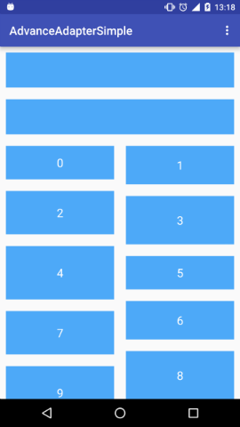
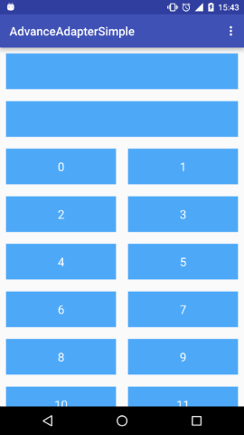
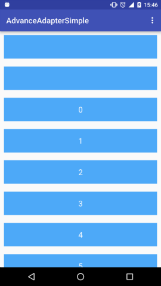

# AdvanceAdapter

> 可以添加Header和Footer的Adapter

* 低侵入性，采用装饰器的方式包裹正真的Adapter,无需修改原本Adapter
* 支持`LinearLayoutManager`、`GridLayoutManager`、`StaggeredGridLayoutManager`
* 可自定义Header和Footer的增加方式

### 运行效果





### 注意

1. 在子Adapter中ViewHolder中调用getLayoutPosition()和getAdapterPosition()时会包含外层已添加的Header和Footer

2. 默认Header和Footer数量最大为100，且`ViewType`中的`Integer.MIN_VALUE`~`Integer.MIN_VALUE+100`、`Integer.MAX_VALUE-100`~`Integer.MAX_VALUE`均被占用

### 使用方法

1. 继承`AdvanceAdapter`并实现其中的抽象方法

2. 使用`AdvanceAdapter`的两个实现类：`DynamicAdapter`、`SingleAdapter`

```
// 包裹你的Adapter，若是GridLayoutManager或StaggeredGridLayoutManager需要传入layoutManager
AdvanceAdapter advanceAdapter=new DynamicAdapter(normalAdapter,layoutManager);
// 给你的RecyclerView设置advanceAdapter
recyclerView.setAdapter(advanceAdapter);
```

### gradle引用方法
```
repositories {
    maven {
        url  "http://dl.bintray.com/zzhoujay/maven"
    }
}

dependencies {
    compile 'com.zzhoujay.advanceadapter:advanceadapter:1.0.2'
}
```


_by zzhoujay_